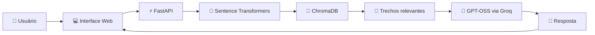

<div align="center">

# 🛒 MIA — Assistente Inteligente do Mercado Central 24h

### Inteligência Artificial Generativa + RAG + Busca Semântica + Cloud

[](http://163.176.19.177:8000)
[](http://163.176.19.177:8000)
[](https://www.docker.com/)

### 🌐 [Testar a MIA](http://163.176.19.177:8000)

</div>

---

## 📌 Sobre o projeto

A **MIA** é uma assistente inteligente desenvolvida para consultar e interpretar informações institucionais do **Mercado Central 24h**.

A aplicação utiliza arquitetura **RAG — Retrieval-Augmented Generation**, combinando:

* busca semântica;
* embeddings;
* banco vetorial;
* recuperação de contexto;
* Inteligência Artificial Generativa.

Antes de responder, a MIA pesquisa sua base documental, recupera os trechos mais relacionados à pergunta e envia essas informações como contexto para o modelo de linguagem.

Isso permite gerar respostas fundamentadas nos documentos oficiais utilizados pelo projeto.

O sistema foi desenvolvido como projeto final do **Challenge Alura Agente**, passando por todas as etapas de desenvolvimento, processamento documental, RAG, interface web, containerização e deploy em nuvem.

---

# 🆕 Atualizações Recentes — Agosto de 2026

Após novos testes da aplicação em produção, foram realizadas melhorias na integração entre o **RAG, ChromaDB e o modelo de linguagem**.

### 🤖 Atualização do modelo de IA

O modelo anteriormente utilizado deixou de estar disponível na API Groq.

A aplicação foi migrada de:

```text
llama-3.1-8b-instant
```

para:

```text
openai/gpt-oss-20b
```

O novo modelo passou a ser utilizado mantendo a arquitetura original baseada em **Groq + RAG + ChromaDB**.

---

### 🔎 Melhoria na recuperação de contexto

A quantidade de trechos recuperados pelo banco vetorial foi ampliada:

```text
TOP_K = 4
```

↓

```text
TOP_K = 8
```

Essa alteração aumentou a quantidade de contexto disponibilizado ao modelo em perguntas mais amplas.

Por exemplo, questões relacionadas a:

* gestão de estoque;
* reposição;
* inventário;
* validade;
* armazenamento;
* FIFO;
* PVPS.

podem exigir informações distribuídas em diferentes partes dos documentos.

---

### 🧠 Ajuste do processamento do GPT-OSS

A geração de respostas também foi otimizada para o novo modelo:

```python
reasoning_effort="low"
include_reasoning=False
max_completion_tokens=1200
```

Com essas configurações, o raciocínio interno do modelo é mantido controlado e uma quantidade maior de tokens fica disponível para a resposta final apresentada ao usuário.

---

### 📚 Reindexação da base RAG

Após as alterações, toda a base documental foi novamente processada.

```text
PDFs processados:      4
Trechos indexados:   188
Banco vetorial: ChromaDB
Embeddings: Sentence Transformers
```

---

### 🐳 Atualização do ambiente em produção

O container da aplicação também foi recriado com:

```text
GROQ_MODEL=openai/gpt-oss-20b
```

mantendo:

```text
--restart unless-stopped
```

Dessa forma, a aplicação permanece ativa na OCI mesmo após o encerramento da conexão SSH utilizada para administração da máquina virtual.

---

### ✅ Validação após atualização

Após as alterações, o funcionamento do RAG foi novamente testado com diferentes categorias da base documental, incluindo:

```text
Cliente VIP
Trocas e devoluções
Delivery
Estoque e operação
Fornecedores
Informações institucionais
```

O fluxo completo permaneceu:

```text
Usuário
   ↓
FastAPI
   ↓
Embedding da pergunta
   ↓
ChromaDB
   ↓
Recuperação de contexto
   ↓
Groq / GPT-OSS
   ↓
Resposta + fontes
```

---

# 🎯 Objetivo

A MIA foi criada para facilitar o acesso às informações do **Mercado Central 24h**, transformando documentos institucionais extensos em uma experiência de consulta simples e conversacional.

A assistente pode responder perguntas relacionadas a:

* 🛒 serviços do Mercado Central 24h;
* ⭐ programa Cliente VIP Central;
* 🚚 delivery e aplicativo;
* 🔄 trocas e devoluções;
* 📦 estoque e operação;
* 🔐 atendimento e privacidade;
* 🤝 fornecedores;
* 📋 regulamento interno.

---

# ✨ Funcionalidades

* 💬 Interface de chat responsiva;
* 📚 Respostas fundamentadas em documentos institucionais;
* 🔎 Busca semântica;
* 🧠 Inteligência Artificial Generativa;
* 🗃️ Banco de dados vetorial;
* 📑 Exibição das fontes consultadas;
* 📋 Botão para copiar respostas;
* 💡 Perguntas sugeridas por categoria;
* ⚠️ Tratamento de erros;
* ⏱️ Controle de timeout;
* 📱 Layout responsivo;
* 🐳 Containerização com Docker;
* ☁️ Deploy na Oracle Cloud Infrastructure;
* 🔄 Reinicialização automática do container.

---

# 🧠 Arquitetura da Solução



### Fluxo RAG

1. O usuário envia uma pergunta;
2. O FastAPI recebe a solicitação;
3. A pergunta é convertida em embedding;
4. O ChromaDB realiza a busca semântica;
5. Os trechos mais relevantes são recuperados;
6. O contexto é enviado ao modelo;
7. O modelo gera a resposta;
8. A interface apresenta a resposta e as fontes consultadas.

---

# 📚 Base de Conhecimento

A base documental da MIA é formada por quatro documentos institucionais:

* 📄 Manual de Fornecedores e Políticas;
* 📄 Manual de Perguntas Frequentes;
* 📄 Política Integrada de Atendimento, Trocas, Devoluções e Privacidade;
* 📄 Regulamento Interno e Manual Operacional.

### Processamento

```text
4 PDFs
   ↓
Extração de texto
   ↓
Divisão em trechos
   ↓
188 chunks
   ↓
Sentence Transformers
   ↓
Embeddings
   ↓
ChromaDB
```

O processamento dos documentos é realizado por:

```text
ingest.py
```

A recuperação dos conteúdos e geração das respostas é controlada por:

```text
rag.py
```

---

# 💬 Exemplos de Perguntas

A MIA pode responder perguntas como:

> Como funciona o programa Cliente VIP Central?

> Quais são as regras para trocas e devoluções?

> Como funciona o delivery do Mercado Central 24h?

> Quais são os principais procedimentos de estoque?

> Como funciona o cadastro de fornecedores?

> Quais documentos são necessários para realizar uma troca?

> Como funciona o atendimento durante a madrugada?

> Quais são as políticas de privacidade?

---

# 🚀 Projetos e conceitos aplicados

O desenvolvimento da MIA envolveu conhecimentos de:

### 🤖 Inteligência Artificial

`IA Generativa` `LLMs` `Prompt Engineering`

### 📚 Retrieval-Augmented Generation

`RAG` `Semantic Search` `Embeddings` `Context Retrieval`

### 📊 Dados

`Vector Database` `ChromaDB` `Sentence Transformers`

### 💻 Desenvolvimento

`Python` `FastAPI` `HTML` `CSS` `JavaScript`

### ☁️ Cloud & DevOps

`Oracle Cloud` `Docker` `Ubuntu` `SSH`

---

# 🛠️ Tecnologias Utilizadas

## Back-end & IA


* Python
* FastAPI
* Uvicorn
* Groq API
* OpenAI GPT-OSS 20B
* ChromaDB
* Sentence Transformers
* PyPDF
* RAG

---

## Front-end


* HTML5
* CSS3
* JavaScript
* Design responsivo
* Interface de chat personalizada

---

## Infraestrutura


* Docker
* Oracle Cloud Infrastructure
* Ubuntu Linux
* Git
* GitHub
* VS Code
* SSH
* Variáveis de ambiente
* VCN
* Sub-rede pública
* Internet Gateway
* Security List
* Swap Linux

---

# 📁 Estrutura do Projeto

```text
MERCADO-IA/
│
├── chroma_db/
│   └── Banco vetorial
│
├── documentos/
│   └── Base documental em PDF
│
├── docs/
│   └── mia-online.png
│
├── static/
│   ├── script.js
│   └── style.css
│
├── templates/
│   └── index.html
│
├── .dockerignore
├── .env.example
├── .gitignore
├── app.py
├── config.py
├── docker-entrypoint.sh
├── Dockerfile
├── ingest.py
├── rag.py
├── requirements.txt
└── README.md
```

---

# 🚀 Como Executar

## 1. Clone o projeto

```bash
git clone https://github.com/DaniellaMateus/mercado-IA.git
cd mercado-IA
```

---

## 2. Crie o ambiente virtual

```bash
python -m venv .venv
```

### Windows

```powershell
Set-ExecutionPolicy -Scope Process -ExecutionPolicy RemoteSigned
.\.venv\Scripts\Activate.ps1
```

### Linux

```bash
source .venv/bin/activate
```

---

## 3. Instale as dependências

```bash
python -m pip install -r requirements.txt
```

---

## 4. Configure a Groq

Crie o arquivo:

```text
.env
```

Utilize:

```env
GROQ_API_KEY=sua_chave_groq
GROQ_MODEL=openai/gpt-oss-20b
```

> Nunca publique sua chave real da Groq no GitHub.

---

## 5. Processe os documentos

```bash
python ingest.py
```

Esse processo:

```text
PDF
 ↓
Extração
 ↓
Chunks
 ↓
Embeddings
 ↓
ChromaDB
```

---

## 6. Execute a aplicação

```bash
python -m uvicorn app:app --reload
```

Acesse:

```text
http://127.0.0.1:8000
```

---

# 🐳 Docker

## Build

```bash
docker build -t mercado-ia .
```

## Executar

```bash
docker run -d \
  --name mercado-ia \
  --restart unless-stopped \
  --env-file .env \
  -p 8000:8000 \
  mercado-ia
```

## Logs

```bash
docker logs -f mercado-ia
```

## Status

```bash
docker ps
```

---

# ☁️ Deploy — Oracle Cloud Infrastructure

A aplicação está hospedada em uma máquina virtual da **Oracle Cloud Infrastructure — OCI**.

### Infraestrutura utilizada

```text
Oracle Cloud
     ↓
Ubuntu VM
     ↓
Docker
     ↓
FastAPI
     ↓
MIA
```

Recursos configurados:

* VM Ubuntu;
* Shape elegível à camada gratuita;
* VCN;
* Sub-rede pública;
* Internet Gateway;
* Tabela de rotas;
* Security List;
* Portas 22 e 8000;
* Docker;
* Swap de 2 GB;
* política `restart unless-stopped`.

### 🌐 Aplicação

**http://163.176.19.177:8000**

[](http://163.176.19.177:8000)

---

# 📸 Evidência do Deploy


A imagem demonstra a aplicação executando diretamente em uma instância pública da OCI.

---

# 🔐 Segurança

O projeto utiliza práticas como:

* `.env` ignorado pelo Git;
* chave da Groq armazenada como variável de ambiente;
* `.env.example` sem credenciais reais;
* tratamento de exceções;
* container Docker isolado;
* configuração da rede OCI;
* conexão administrativa via SSH;
* credenciais não armazenadas diretamente no código.

---

# ✅ Entregáveis do Challenge Alura

| Entregável                   | Status |
| ---------------------------- | ------ |
| Repositório público          | ✅      |
| Histórico de commits         | ✅      |
| Estrutura organizada         | ✅      |
| Descrição do projeto         | ✅      |
| Arquitetura RAG              | ✅      |
| Tecnologias documentadas     | ✅      |
| Execução local               | ✅      |
| Execução com Docker          | ✅      |
| Exemplos de perguntas        | ✅      |
| Exemplos de respostas        | ✅      |
| Processamento de PDFs        | ✅      |
| Banco vetorial               | ✅      |
| Agente inteligente funcional | ✅      |
| Deploy em Cloud              | ✅      |
| Link público                 | ✅      |
| Evidência do deploy          | ✅      |

---

# 🏆 Diferenciais do Projeto

* Arquitetura RAG completa;
* busca semântica;
* respostas fundamentadas em documentos;
* recuperação de múltiplos trechos de contexto;
* indicação das fontes consultadas;
* IA Generativa integrada via Groq;
* banco vetorial ChromaDB;
* API com FastAPI;
* interface própria;
* aplicação responsiva;
* containerização com Docker;
* deploy na Oracle Cloud;
* aplicação publicamente acessível;
* tratamento de falhas e atualização do modelo de produção;
* otimização da recuperação de contexto;
* infraestrutura configurada manualmente em ambiente Linux.

---

# 📈 Melhorias Futuras

* 🌐 domínio personalizado;
* 🔐 HTTPS;
* 🧪 testes automatizados;
* 📊 métricas de qualidade do RAG;
* 📈 monitoramento da aplicação;
* 💾 persistência externa do ChromaDB;
* 🗂️ painel para gerenciamento dos documentos;
* ⚙️ CI/CD;
* 🔍 técnicas avançadas de reranking;
* 🔎 busca híbrida semântica + palavras-chave.

---

# 👩‍💻 Autora

## Daniella Mateus Batista

Desenvolvimento com foco em **Dados, Inteligência Artificial e Cloud Computing**.

[](https://www.linkedin.com/in/daniellamateus-batista/)

[](https://github.com/DaniellaMateus)

---

# 🎓 Contexto Acadêmico

Projeto desenvolvido para o **Challenge Alura Agente**, aplicando conhecimentos relacionados a:

`Inteligência Artificial Generativa`

`Prompt Engineering`

`RAG`

`Embeddings`

`Busca Semântica`

`Vector Databases`

`FastAPI`

`Docker`

`Cloud Computing`

`Oracle Cloud Infrastructure`

`Git & GitHub`

---

<div align="center">

## 💗 MIA — Informação inteligente, disponível 24 horas

[](http://163.176.19.177:8000)

**Desenvolvido por Daniella Mateus Batista**

</div>
