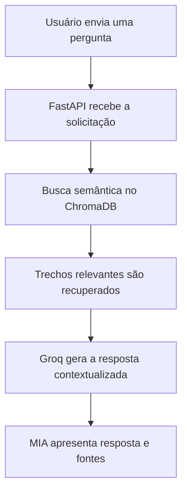

<div align="center">

# 🛒 MIA — Assistente Inteligente do Mercado Central 24h

### Inteligência Artificial Generativa + RAG para atendimento institucional

A **MIA** é uma assistente virtual desenvolvida para responder dúvidas sobre os serviços, políticas e operações do **Mercado Central 24h**, utilizando informações recuperadas de documentos institucionais.

[](http://163.176.19.177:8000)

### 🌐 [Clique aqui para acessar a aplicação](http://163.176.19.177:8000)

</div>

---

## 📌 Sobre o projeto

O projeto foi desenvolvido para o **Challenge da Alura**, com o objetivo de criar uma aplicação de Inteligência Artificial capaz de consultar uma base documental e produzir respostas contextualizadas.

A MIA utiliza a arquitetura **RAG — Retrieval-Augmented Generation**. Antes de produzir uma resposta, a aplicação realiza uma busca semântica nos documentos oficiais do Mercado Central 24h, recupera os trechos relevantes e os envia como contexto para o modelo de linguagem.

Dessa forma, as respostas ficam mais relacionadas às informações reais da organização.

---

## ✨ Principais funcionalidades

- 💬 Interface de chat responsiva e intuitiva;
- 📚 Consulta semântica a documentos institucionais;
- 🧠 Geração de respostas contextualizadas com IA;
- 🔎 Exibição das fontes consultadas;
- 📋 Botão para copiar as respostas;
- ⚡ Perguntas sugeridas por categoria;
- 🛡️ Tratamento de erros, indisponibilidade e tempo limite;
- 📱 Adaptação para computadores, tablets e celulares;
- ☁️ Aplicação publicada na Oracle Cloud Infrastructure;
- 🐳 Execução em container Docker;
- 🔄 Reinicialização automática do serviço.

---

## 🗂️ Conteúdos disponíveis

A base de conhecimento da MIA possui documentos relacionados a:

- Visão geral do Mercado Central 24h;
- Programa Cliente VIP Central;
- Delivery e aplicativo;
- Trocas e devoluções;
- Estoque e operação;
- Fornecedores;
- Atendimento e privacidade;
- Regulamento interno.

Atualmente, a base vetorial possui:

- **4 documentos PDF indexados**;
- **188 trechos disponíveis para busca semântica**.

---

## 🧠 Como o RAG funciona



### Fluxo da resposta

1. A pessoa usuária envia uma pergunta pela interface;
2. A API processa e transforma a pergunta em uma representação vetorial;
3. O ChromaDB pesquisa os trechos semanticamente mais próximos;
4. Os trechos recuperados são adicionados ao contexto;
5. O modelo de linguagem gera uma resposta baseada nesse contexto;
6. A MIA apresenta a resposta e as fontes consultadas.

---

## 🛠️ Tecnologias utilizadas

### Back-end e Inteligência Artificial


- Python;
- FastAPI;
- Uvicorn;
- Groq API;
- ChromaDB;
- Sentence Transformers;
- PyPDF;
- RAG.

### Front-end


- HTML5;
- CSS3;
- JavaScript;
- Design responsivo;
- Identidade visual personalizada em branco, rosa e laranja.

### Infraestrutura


- Docker;
- Oracle Cloud Infrastructure;
- Ubuntu Linux;
- Git e GitHub;
- Rede VCN e sub-rede pública;
- Internet Gateway;
- Regras de rota e segurança;
- Swap de 2 GB para estabilidade da VM.

---

## ☁️ Aplicação online

A MIA está hospedada em uma máquina virtual na **Oracle Cloud Infrastructure — OCI**, na região de São Paulo.

### 👉 [Acessar a MIA](http://163.176.19.177:8000)

```text
http://163.176.19.177:8000
```

Não é necessário instalar o projeto para testar a versão online.

> A aplicação utiliza atualmente um endereço HTTP fornecido diretamente pela instância da OCI.

---

## 📁 Estrutura do projeto

```text
MERCADO-IA/
│
├── chroma_db/                 # Base vetorial
├── documentos/               # Documentos institucionais em PDF
├── static/
│   ├── script.js              # Interações da interface
│   └── style.css              # Identidade visual
├── templates/
│   └── index.html             # Página principal
│
├── .dockerignore
├── .env.example               # Modelo das variáveis de ambiente
├── .gitignore
├── app.py                     # API e rotas da aplicação
├── config.py                  # Configurações
├── docker-entrypoint.sh       # Inicialização do container
├── Dockerfile
├── ingest.py                  # Indexação dos documentos
├── rag.py                     # Recuperação e geração das respostas
├── requirements.txt
└── README.md
```

---

## 🚀 Executando localmente

### 1. Clone o repositório

```bash
git clone https://github.com/DaniellaMateus/mercado-IA.git
cd mercado-IA
```

### 2. Crie o ambiente virtual

```bash
python -m venv .venv
```

No Windows PowerShell:

```powershell
Set-ExecutionPolicy -Scope Process -ExecutionPolicy RemoteSigned
.\.venv\Scripts\Activate.ps1
```

### 3. Instale as dependências

```bash
python -m pip install -r requirements.txt
```

### 4. Configure as variáveis de ambiente

Crie o arquivo `.env` com base no `.env.example`:

```env
GROQ_API_KEY=sua_chave_groq
GROQ_MODEL=llama-3.1-8b-instant
```

> Nunca publique sua chave real no GitHub.

### 5. Prepare a base vetorial

```bash
python ingest.py
```

### 6. Inicie a aplicação

```bash
python -m uvicorn app:app --reload
```

Acesse:

```text
http://127.0.0.1:8000
```

---

## 🐳 Executando com Docker

Construa a imagem:

```bash
docker build -t mercado-ia .
```

Inicie o container:

```bash
docker run -d \
  --name mercado-ia \
  --restart unless-stopped \
  --env-file .env \
  -p 8000:8000 \
  mercado-ia
```

Acompanhe os registros:

```bash
docker logs -f mercado-ia
```

---

## 🔐 Segurança

O projeto adota alguns cuidados importantes:

- A chave da API é armazenada no arquivo `.env`;
- O `.env` não é versionado no GitHub;
- O repositório fornece somente o `.env.example`;
- As credenciais são passadas ao container por variáveis de ambiente;
- A aplicação possui tratamento de erros e tempo limite;
- Os documentos são processados dentro da própria infraestrutura;
- A porta SSH é utilizada apenas para administração da VM.

---

## 🎯 Diferenciais do projeto

- Integração completa entre IA, RAG, front-end e cloud;
- Base de conhecimento criada a partir de documentos institucionais;
- Respostas contextualizadas em vez de um chatbot genérico;
- Interface própria com identidade visual da MIA;
- Indicação das fontes utilizadas;
- Aplicação disponível publicamente na nuvem;
- Containerização com Docker;
- Infraestrutura configurada manualmente na OCI;
- Projeto desenvolvido do ambiente local até a publicação.

---

## 📈 Próximas melhorias

- Configurar domínio personalizado e HTTPS;
- Adicionar testes automatizados;
- Implementar monitoramento da aplicação;
- Criar volume persistente para a base vetorial;
- Desenvolver um painel para gerenciamento dos documentos;
- Automatizar o deploy com CI/CD;
- Adicionar métricas de qualidade das respostas.

---

## 👩‍💻 Autora

**Daniella Mateus Batista**

Estudante e profissional em desenvolvimento nas áreas de **Dados, Inteligência Artificial e Cloud Computing**.

[](https://www.linkedin.com/in/daniellamateus-batista/)

[](https://github.com/DaniellaMateus)

---

## 🎓 Contexto acadêmico

Projeto desenvolvido para o **Challenge da Alura**, aplicando conhecimentos de:

- Inteligência Artificial Generativa;
- Recuperação Aumentada por Geração;
- Bancos de dados vetoriais;
- Desenvolvimento de APIs;
- Engenharia de prompts;
- Desenvolvimento front-end;
- Docker;
- Git e GitHub;
- Computação em nuvem com OCI.

---

<div align="center">

### 💗 MIA — Informação inteligente, disponível 24 horas.

[](http://163.176.19.177:8000)

Desenvolvido por **Daniella Mateus Batista**

</div>
