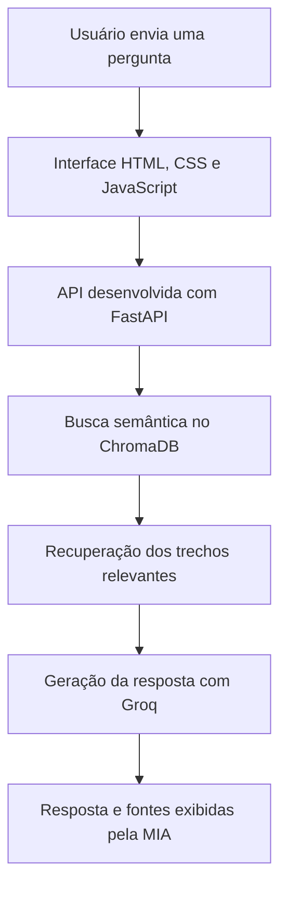

<div align="center">

# 🛒 MIA — Assistente Inteligente do Mercado Central 24h

### Inteligência Artificial Generativa com arquitetura RAG para atendimento institucional

[](http://163.176.19.177:8000)
[](http://163.176.19.177:8000)
[](https://www.docker.com/)

## 🌐 [Clique aqui para testar a MIA](http://163.176.19.177:8000)

</div>

---

## 📌 Descrição do projeto

A **MIA** é uma assistente inteligente desenvolvida para responder perguntas relacionadas aos serviços, políticas e operações do **Mercado Central 24h**.

O projeto utiliza a arquitetura **RAG — Retrieval-Augmented Generation**, combinando busca semântica em documentos institucionais com um modelo de linguagem executado por meio da API Groq.

Antes de gerar uma resposta, a aplicação consulta sua base documental, recupera os trechos mais relevantes e os utiliza como contexto para produzir uma resposta mais precisa e relacionada às informações oficiais da organização.

O projeto foi desenvolvido como parte do **Challenge Alura Agente**, contemplando desde o processamento dos documentos até a publicação da aplicação na **Oracle Cloud Infrastructure — OCI**.

---

## 🎯 Objetivo

O objetivo da MIA é facilitar o acesso às informações do Mercado Central 24h, permitindo que clientes, colaboradores e fornecedores encontrem respostas de maneira rápida, simples e disponível durante 24 horas.

A assistente pode responder perguntas sobre:

- Serviços do Mercado Central 24h;
- Programa Cliente VIP Central;
- Delivery e aplicativo;
- Trocas e devoluções;
- Estoque e operação;
- Atendimento e privacidade;
- Cadastro de fornecedores;
- Regulamento interno.

---

## ✨ Funcionalidades

- 💬 Interface de chat intuitiva e responsiva;
- 📚 Respostas fundamentadas em documentos institucionais;
- 🔍 Busca semântica em banco de dados vetorial;
- 🧠 Geração de respostas com Inteligência Artificial;
- 📑 Exibição das fontes consultadas;
- 📋 Botão para copiar respostas;
- 💡 Sugestões de perguntas por categoria;
- ⚠️ Tratamento de erros e indisponibilidade;
- ⏱️ Controle de tempo limite das requisições;
- 📱 Compatibilidade com computadores e dispositivos móveis;
- 🐳 Execução em container Docker;
- ☁️ Deploy na Oracle Cloud Infrastructure;
- 🔄 Reinicialização automática da aplicação.

---

## 🧠 Arquitetura da solução



### Etapas do processamento

1. A pessoa usuária envia uma pergunta pela interface;
2. O FastAPI recebe e valida a solicitação;
3. A pergunta é transformada em uma representação vetorial;
4. O ChromaDB pesquisa os conteúdos semanticamente mais próximos;
5. Os trechos recuperados são adicionados ao contexto;
6. O modelo de linguagem gera uma resposta baseada no contexto;
7. A interface apresenta a resposta e as fontes consultadas.

---

## 📚 Base de conhecimento

A base da MIA foi construída a partir de quatro documentos institucionais em PDF:

- Manual de fornecedores e políticas;
- Manual de perguntas frequentes;
- Política integrada de atendimento, trocas, devoluções e privacidade;
- Regulamento interno e manual operacional.

Durante o processo de indexação:

- **4 documentos PDF foram processados**;
- **188 trechos foram criados**;
- Os embeddings foram gerados com Sentence Transformers;
- Os vetores foram armazenados no ChromaDB.

O processamento é realizado pelo arquivo `ingest.py`, enquanto a recuperação dos documentos e a geração das respostas são coordenadas pelo arquivo `rag.py`.

---

## 💬 Exemplos de perguntas

A MIA consegue responder perguntas como:

- Quais são os principais serviços do Mercado Central 24h?
- Como funciona o programa Cliente VIP Central?
- Quais são as regras para trocas e devoluções?
- Como funciona o delivery e o aplicativo?
- Quais são os principais procedimentos de estoque?
- Como é realizado o cadastro de fornecedores?
- Quais documentos são necessários para efetuar uma troca?
- Como funciona o atendimento durante a madrugada?
- Quais são as regras de privacidade?
- Como posso obter benefícios e descontos?

---

## 🧪 Exemplos de respostas geradas

### Exemplo 1 — Serviços disponíveis

**Pergunta:**

> Quais são os principais serviços do Mercado Central 24h?

**Resposta da MIA:**

> O Mercado Central 24h oferece atendimento presencial durante 24 horas, serviço de delivery, aplicativo para compras, programa de fidelidade Cliente VIP Central e suporte para trocas e devoluções. Os serviços foram estruturados para proporcionar praticidade, segurança e atendimento contínuo aos clientes.

---

### Exemplo 2 — Programa Cliente VIP

**Pergunta:**

> Como funciona o programa Cliente VIP Central?

**Resposta da MIA:**

> O Cliente VIP Central é um programa de fidelidade com cadastro gratuito. Os clientes participantes podem receber descontos, acumular cashback e acessar benefícios exclusivos. O cadastro pode ser realizado pelos canais disponibilizados pelo Mercado Central 24h mediante o fornecimento das informações solicitadas.

---

### Exemplo 3 — Trocas e devoluções

**Pergunta:**

> Quais são as regras para trocas e devoluções?

**Resposta da MIA:**

> As regras variam conforme o tipo e a condição do produto. Produtos perecíveis devem ser apresentados dentro do período determinado e acompanhados do comprovante de compra. Também são verificados fatores como validade, conservação, embalagem e condições de armazenamento.

> As respostas são geradas com base nos trechos recuperados dos documentos institucionais.

---

## 📸 Evidência do deploy na OCI

A aplicação foi implantada em uma máquina virtual na **Oracle Cloud Infrastructure**, utilizando Ubuntu Linux e Docker.

### 🌐 [Acessar aplicação online](http://163.176.19.177:8000)


A captura demonstra a MIA sendo acessada pelo endereço IP público da instância da OCI e respondendo a uma pergunta baseada em sua documentação institucional.

---

## 🛠️ Tecnologias utilizadas

### Back-end e Inteligência Artificial


- Python;
- FastAPI;
- Uvicorn;
- Groq API;
- ChromaDB;
- Sentence Transformers;
- PyPDF;
- RAG.

### Front-end


- HTML5;
- CSS3;
- JavaScript;
- Design responsivo;
- Identidade visual personalizada em branco, rosa e laranja.

### Infraestrutura e desenvolvimento


- Docker;
- Oracle Cloud Infrastructure;
- Ubuntu Linux;
- Git e GitHub;
- Visual Studio Code;
- Variáveis de ambiente;
- Rede VCN e sub-rede pública;
- Internet Gateway;
- Tabela de rotas;
- Lista de segurança;
- Conexão SSH;
- Swap de 2 GB para estabilidade da VM.

---

## 📁 Estrutura do projeto

```text
MERCADO-IA/
│
├── chroma_db/                 # Banco de dados vetorial
├── documentos/               # Documentos institucionais
├── docs/
│   └── mia-online.png         # Evidência do deploy
├── static/
│   ├── script.js              # Interações da interface
│   └── style.css              # Estilização
├── templates/
│   └── index.html             # Página principal
│
├── .dockerignore
├── .env.example               # Modelo das variáveis
├── .gitignore
├── app.py                     # API e rotas
├── config.py                  # Configurações
├── docker-entrypoint.sh       # Inicialização do container
├── Dockerfile                 # Imagem Docker
├── ingest.py                  # Processamento dos documentos
├── rag.py                     # Busca e geração de respostas
├── requirements.txt           # Dependências
└── README.md
```

---

## 🚀 Como executar o projeto

### Pré-requisitos

- Python instalado;
- Git instalado;
- Uma chave válida da API Groq.

### 1. Clone o repositório

```bash
git clone https://github.com/DaniellaMateus/mercado-IA.git
cd mercado-IA
```

### 2. Crie o ambiente virtual

```bash
python -m venv .venv
```

No Windows PowerShell:

```powershell
Set-ExecutionPolicy -Scope Process -ExecutionPolicy RemoteSigned
.\.venv\Scripts\Activate.ps1
```

No Linux:

```bash
source .venv/bin/activate
```

### 3. Instale as dependências

```bash
python -m pip install -r requirements.txt
```

### 4. Configure as variáveis de ambiente

Crie um arquivo chamado `.env` a partir do `.env.example`:

```env
GROQ_API_KEY=sua_chave_groq
GROQ_MODEL=llama-3.1-8b-instant
```

> A chave real não deve ser publicada no GitHub.

### 5. Processe os documentos

```bash
python ingest.py
```

Esse comando lê os arquivos PDF, divide os textos em trechos, gera os embeddings e armazena os vetores no ChromaDB.

### 6. Inicie a aplicação

```bash
python -m uvicorn app:app --reload
```

Abra no navegador:

```text
http://127.0.0.1:8000
```

---

## 🐳 Execução com Docker

### Construir a imagem

```bash
docker build -t mercado-ia .
```

### Iniciar o container

```bash
docker run -d \
  --name mercado-ia \
  --restart unless-stopped \
  --env-file .env \
  -p 8000:8000 \
  mercado-ia
```

### Visualizar os logs

```bash
docker logs -f mercado-ia
```

### Verificar o container

```bash
docker ps
```

---

## ☁️ Deploy na Oracle Cloud Infrastructure

A aplicação está hospedada em uma instância da OCI localizada na região de São Paulo.

### Recursos configurados

- Máquina virtual Ubuntu;
- Shape elegível à camada gratuita;
- Virtual Cloud Network;
- Sub-rede pública;
- Internet Gateway;
- Regra de rota para acesso à internet;
- Regras de entrada para as portas 22 e 8000;
- Docker para execução da aplicação;
- Swap de 2 GB;
- Política de reinicialização automática do container.

### Endereço público

```text
http://163.176.19.177:8000
```

### 👉 [Testar a MIA na OCI](http://163.176.19.177:8000)

---

## 🔐 Segurança

O projeto utiliza as seguintes práticas:

- Credenciais armazenadas no arquivo `.env`;
- `.env` ignorado pelo Git;
- Disponibilização somente do `.env.example`;
- Variáveis de ambiente enviadas ao container;
- Chave da API não registrada no código;
- Tratamento de erros no back-end;
- Controle de tempo limite no front-end.

---

## ✅ Entregáveis do Challenge Alura

| Entregável | Implementação |
|---|---|
| Repositório público no GitHub | ✅ Disponível |
| Histórico de commits | ✅ Mantido com Git |
| Estrutura organizada | ✅ Separação entre API, RAG, documentos e interface |
| Descrição do projeto | ✅ Documentada |
| Arquitetura da solução | ✅ Fluxo RAG documentado |
| Tecnologias utilizadas | ✅ Listadas no README |
| Instruções de execução | ✅ Execução local e Docker |
| Exemplos de perguntas | ✅ Incluídos |
| Exemplos de respostas | ✅ Incluídos |
| Agente funcional | ✅ Testado |
| Leitura e processamento de PDF | ✅ Implementado em `ingest.py` |
| Busca em base documental | ✅ ChromaDB |
| Link público | ✅ Aplicação online |
| Evidência do deploy | ✅ Captura da aplicação na OCI |

---

## 🎯 Diferenciais

- Projeto completo, do desenvolvimento ao deploy;
- Aplicação de IA Generativa em um cenário de atendimento;
- Uso de arquitetura RAG;
- Respostas fundamentadas em documentos;
- Interface própria com identidade visual;
- Exibição das fontes consultadas;
- Banco vetorial;
- API desenvolvida com FastAPI;
- Containerização com Docker;
- Infraestrutura configurada na OCI;
- Aplicação disponível publicamente.

---

## 📈 Melhorias futuras

- Configuração de domínio e HTTPS;
- Testes automatizados;
- Monitoramento da aplicação;
- Volume persistente para o ChromaDB;
- Painel de gerenciamento de documentos;
- Deploy automatizado com CI/CD;
- Métricas de avaliação das respostas.

---

## 👩‍💻 Autora

### Daniella Mateus Batista

Profissional em desenvolvimento nas áreas de **Dados, Inteligência Artificial e Cloud Computing**.

[](https://www.linkedin.com/in/daniellamateus-batista/)

[](https://github.com/DaniellaMateus)

---

## 🎓 Contexto acadêmico

Projeto desenvolvido para o **Challenge Alura Agente**, aplicando conhecimentos de:

- Inteligência Artificial Generativa;
- Engenharia de prompts;
- Arquitetura RAG;
- Processamento de documentos;
- Bancos de dados vetoriais;
- Desenvolvimento de APIs;
- Desenvolvimento front-end;
- Docker;
- Git e GitHub;
- Oracle Cloud Infrastructure.

---

<div align="center">

## 💗 MIA — Informação inteligente, disponível 24 horas

[](http://163.176.19.177:8000)

Desenvolvido por **Daniella Mateus Batista**

</div>
